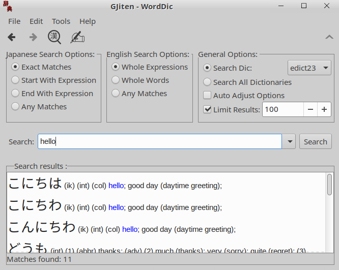
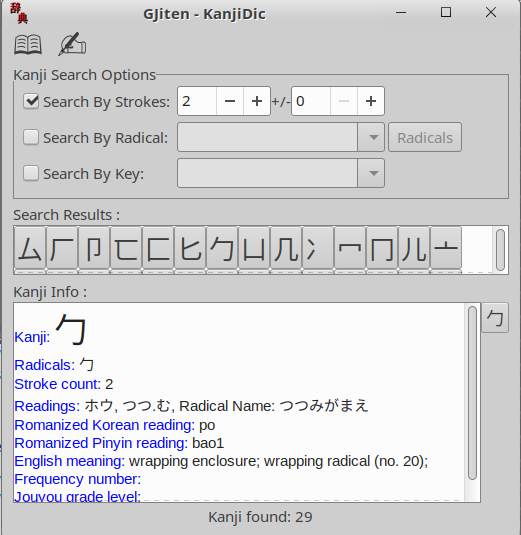

# GJiten

GJiten is a dictionary

Gjiten is a Japanese dictionary program for `edict` files.
It also contains a kanji dictionary.

 


## Building / Installing

On Ubuntu:

```bash
# install all dependencies
sudo apt update
sudo apt install build-essential libgtk-3-dev

# init
meson setup build
# build
ninja -C build
# install
ninja -C build install
```

## Ubuntu: Official Repos / Sponsoring

I'm trying to get this GTK3-Port into the official repos. If you can help me with that, please contact me.


## How to Develop

Use the option `-Denable_debug=true` while developing

```bash
# Add `universe` repository
sudo add-apt-repository "deb http://archive.ubuntu.com/ubuntu $(lsb_release -sc) universe"
sudo apt update
# install all dependencies
sudo apt install build-essential libgtk-3-dev

# build it with
meson setup -Denable_debug=true build
ninja -C build

# run it
cd build/src
./gjiten
```

With `-Denable_debug=true` you have to start gjiten from within `src`. Otherwise static paths will be invalid and you'll encounter various problems.

If you change the debug settings, run `meson setup -Denable_debug=true --reconfigure build`


# Reporting Bugs

Report bugs directly here on Github.

If you file bugs please try to include the following information:
- gjiten version ( `gjiten --version` )
- distribution and other info about your OS
  (under Ubuntu: `lsb_release --all`)
- gtk release ( `pkg-config --modversion gtk+-3.0` )
- output of `gdb gjiten` and/or `strace gjiten`
- and any other info you might think is important.


# User Settings
User settings are stored in `<system config path>/gjiten/gjiten.config` .
Under Ubuntu this amounts to `~/.config/gjiten/gjiten.conf`.
